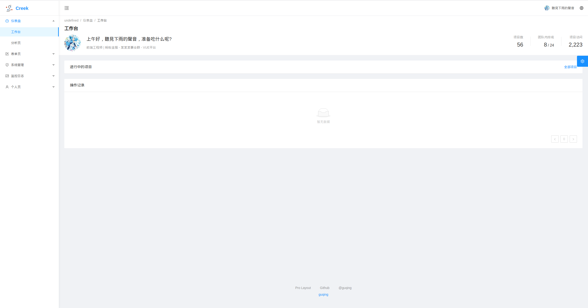
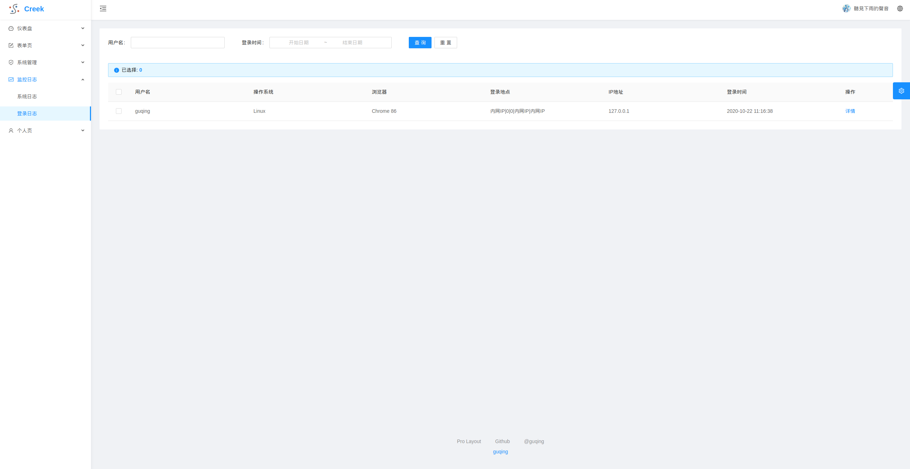
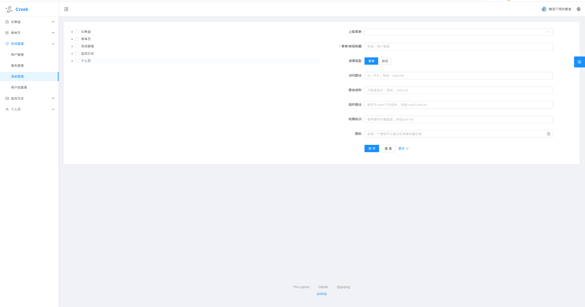
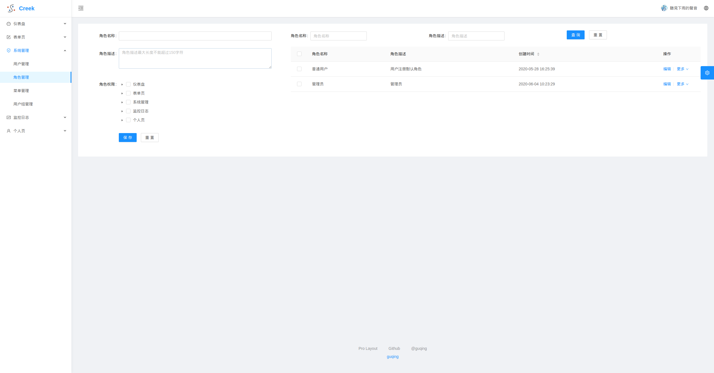
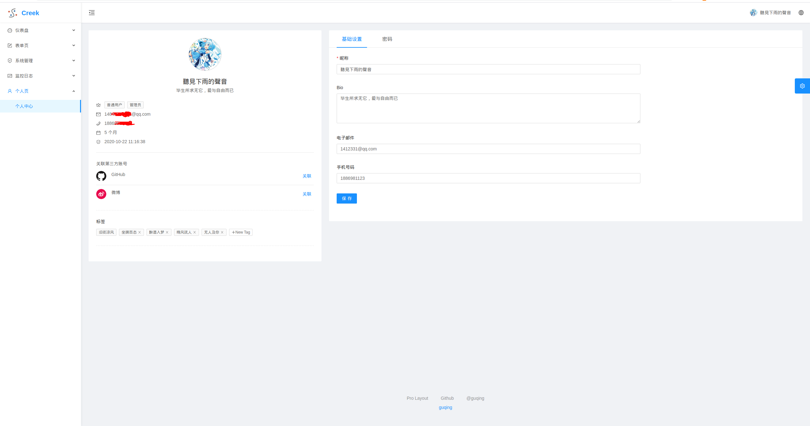

# creek-console
## 说明
该后端使用ant-design-pro-vue模板，权限管理后台
## 安装
使用`npm`安装
```shell
# 安装
cnpm install

# 运行
npm run serve
```

或者使用`yarn`安装
```shell
安装依赖
yarn install

开发模式运行
yarn run serve

编译项目
yarn run build
```

## 项目预览

[Creek 后台项目地址](https://github.com/guqing/creek.git)





